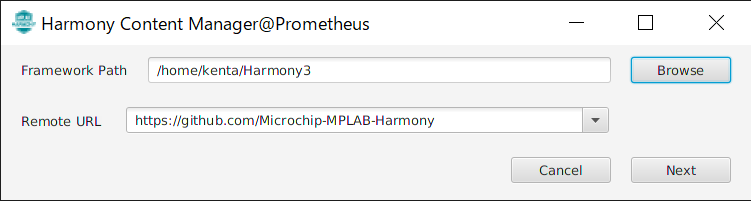
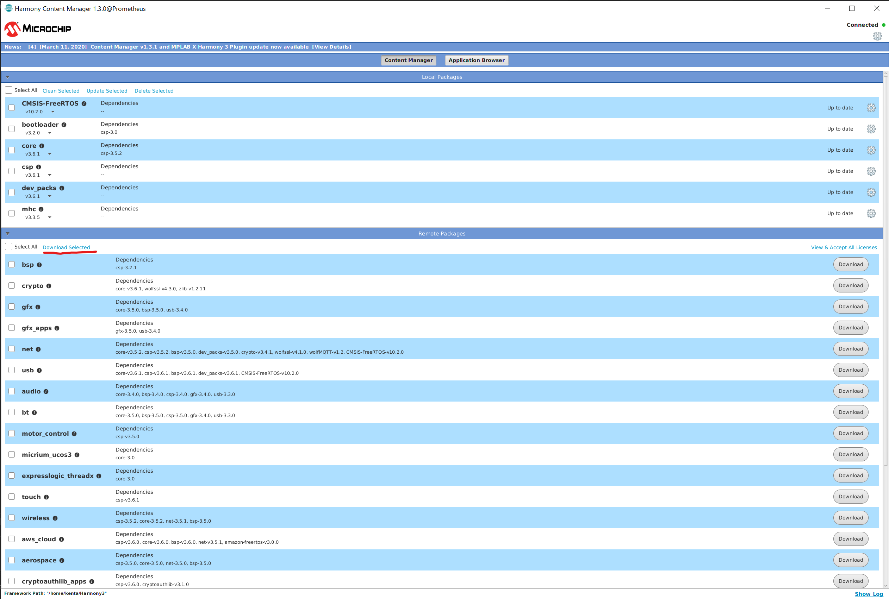
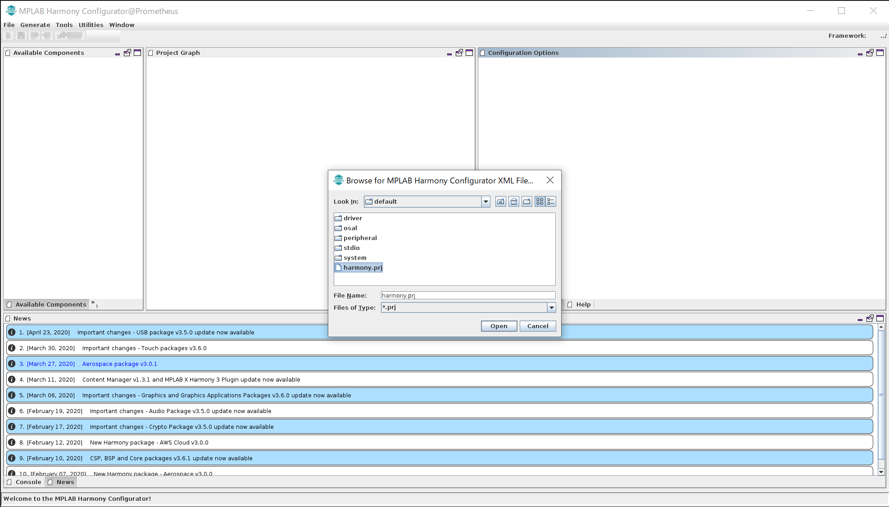
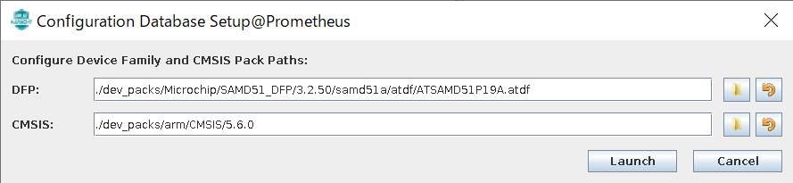
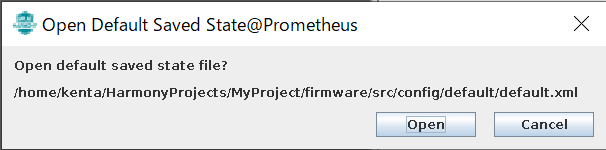
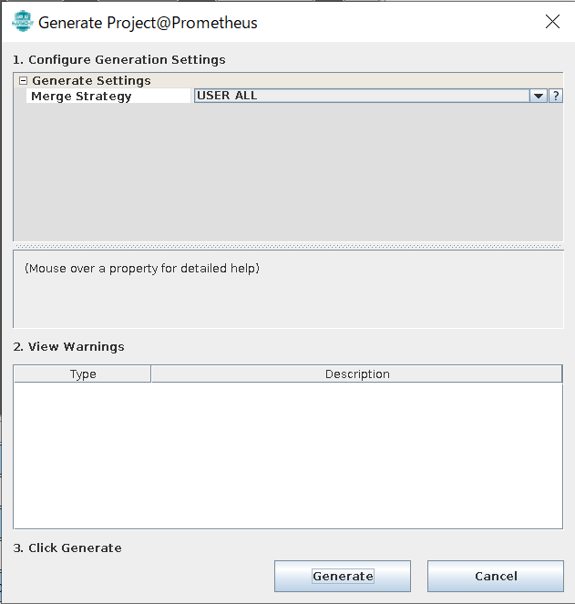
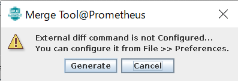
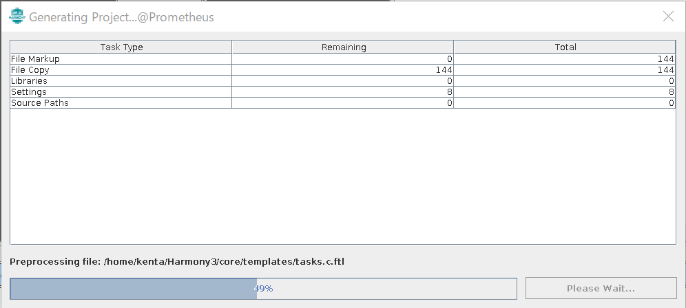

# Wio Terminal用 MPLAB Harmonyプロジェクト

## 概要

MPLAB Harmonyを使ってWio Terminalのソフトを作るためのテンプレート

OpenOCDによるソースレベルデバッグもできます。

## 必要なもの

* MPLAB Harmony v3
    * ドライバを生成するのに使います。
* CMake + Ninja
    * ソースコードのビルドに使います。

* OpenOCD
    * Ubuntuのパッケージで入れられるのは古いので、ビルドが必要
* OpenOCDから使えるSWDデバッガ
    * FT2232D + 470Ω抵抗とかが楽でお勧め
    * STLink-V2とかでもいけるはず

## 環境構築

以降、Ubuntuでの環境構築手順を示します。
確認した環境は `Ubuntu 20.042 LTS` です。

### OpenOCDの準備

UbuntuのパッケージにあるOpenOCDは古くDAPを扱うことができなかったので、ソースコードをとってきてビルドします。
サーバーが遅いらしく、コードの取得に結構時間がかかります。

```
sudo apt install -y libhidapi-dev libusb-1.0-0-dev libftdi-dev
cd ~
git clone --recursive git://git.code.sf.net/p/openocd/code openocd-code
cd openocd-code
./bootstrap
./configure --prefix=$HOME/openocd --enable-ftdi --enable-stlink --enable-cmsis-dap --enable-jlink
make -j
make install
```

これで、`~/openocd` 以下に最新のOpenOCDがインストールされます。


### MPLAB Harmony v3の準備

MPLAB Harmony v3はMicrochipのマイコン向けのドライバなどのコードを生成するフレームワークです。
インストールしていない場合は、以下の手順でインストールします。

```
sudo apt install -y openjfx
mkdir -p ~/Harmony3
cd ~/Harmony3
git clone https://github.com/Microchip-MPLAB-Harmony/contentmanager
```

MPLAB Harmony v3のインストールはcontentmanagerというGUI経由で行います。動作にはJavaFXが必要なので、ちょっとオプションを追加して起動します。

```
cd ~/Harmony3/contentmanager
java \
  -p /usr/share/openjfx/lib \
  --add-modules javafx.controls \
  --add-modules javafx.swing \
  --add-modules javafx.base \
  --add-modules javafx.fxml \
  --add-modules javafx.media \
  --add-modules javafx.web \
  -jar harmony-content-manager.jar
```

起動したらHarmonyのルートディレクトリを聞かれるので、 `~/Harmony3`にしておきます。



メイン画面の `Remote Packages` リストで必要なパッケージにチェックを入れて、Downloadを押します。

必要なパッケージは、

* CMSIS-FreeRTOS
* bootloader
* core
* csp
* dev_packs
* mhc

です。

ダウンロードが終わると、先ほどチェックを入れたパッケージが`Local Packages` の方に移動します。



これで必要なHarmony v3のパッケージがそろいました。

### Harmony v3でドライバのソースコードを生成

`~/Harmony3/mhc` に MPLAB Harmony Configuratorが入っているので、以下のコマンドで起動します。

```
cd ~/Harmony3/mhc
sh ./runmhc.sh
```

起動したら、`File->Open Configuration` を選択して出てきたファイル選択画面でこのリポジトリの `firmware/src/config/default/harmony.prj` を開きます。



CMSISの場所などを聞かれますが、デフォルトのままでOKです。



しばらくするとデフォルトのstateを開くか聞かれるので、`Open` を選択します。



その後、`Generate->Generate Code`を選択して、出てきた画面で `Generate` を押します。



External Diffツールが無いとか言われますが、無視して `Generate` を押します。



コード生成中は以下の画面が表示されます。終わったら消えます。



以上でMHCでドライバのコードの復元が終わりました。
設定をカスタマイズしたい場合は、MPLAB Harmonyのドキュメントを読みながら適当に触ってみてください。

## ビルド

とりあえずビルドに必要なものをインストールします。

```
sudo apt install -y cmake ninja arm-none-eabi-gcc gcc-arm-none-eabi
```

buildディレクトリを作ってCMakeでビルドします。

```
mkdir build
cd build
cmake -G Ninja ..
ninja
```

成功すれば、`build/MyProjects.bin`ができているはずです。

## 書き込み

書き込みには、ブートローダーを使う方法とデバッガを使う方法があります。


### ブートローダーで書き込む

ブートローダーで書き込むには `bossac` コマンドが必要なのでインストールします。

```
sudo apt install -y bossa-cli
```

Wio TerminalをPCに接続し、素早くスイッチを2回リセット側にスライドします。
成功すれば、本体下部の青色LEDがゆっくり点滅します。

この状態で、以下のコマンドを実行すると、ビルドしたアプリケーションが書き込まれます。

```
sudo bossac -U -R -i --offset 0x4000 -w -v build/MyProject.bin
```

### デバッガで書き込んでデバッグする

Wio Terminalの基板上にはデバッグ用の信号に対応するパッドがでていますので、筐体を分解してデバッガ回路と結線すればOpenOCDを用いてデバッグを行えます。
ばらした場合の諸問題についてはここには書きませんので、自己責任でお願いします。

以下にFT2232Dを使う場合の結線を示します。(実際には秋月電子の`AE-FT2232`を使用)

| Wio Terminal | FT2232D | AE-FT2232 |
|:------------|:--------|:------|
| SWDCLK | ADBUS0 | AD0 |
| SWDIO  | ADBUS2 | AD2 |
| RST    | ADBUS5 | AD5 |
| GND    | GND | GND |

また、FT2232DのAD1とAD2の間に100Ω程度の抵抗を接続します。

別のデバッガ (ST-Link v2など)をつなぐ場合は、デバッガのピン配置や接続方法に従ってください。

接続後、以下のコマンドでファームウェア書き込みとデバッグを行うことができます。


```
~/openocd/bin/openocd -s ~/openocd/share/openocd/scripts -f openocd.tcl -c "flash_bin build/MyProject.bin"
```

上記コマンドでOpenOCDによるGDB Serverが立ち上がった状態になるので、別のコンソールでGDBから接続します。
gdn-multiarchをインストールしていない場合はaptでインストールします。

```
sudo apt install -y gdb-multiarch
```

gdb-multiarchを起動します。

```
gdb-multiarch
```

gdb-multiarch上で以下のコマンドを実行します。


```
target remote localhost:3333
symbol-file build/MyProject.elf
monitor reset halt
cont
```

Ctrl+Cを押すとブレークします。

### VSCodeから扱う

リポジトリにはVSCode用の設定が含まれていますので、このリポジトリのルートディレクトリのフォルダを開くと、以下の手順でデバッグ出来ます。

* Ctrl+Bでbuildタスクを実行
* F5を押してデバッグ実行
    * エントリポイントで停止します。
